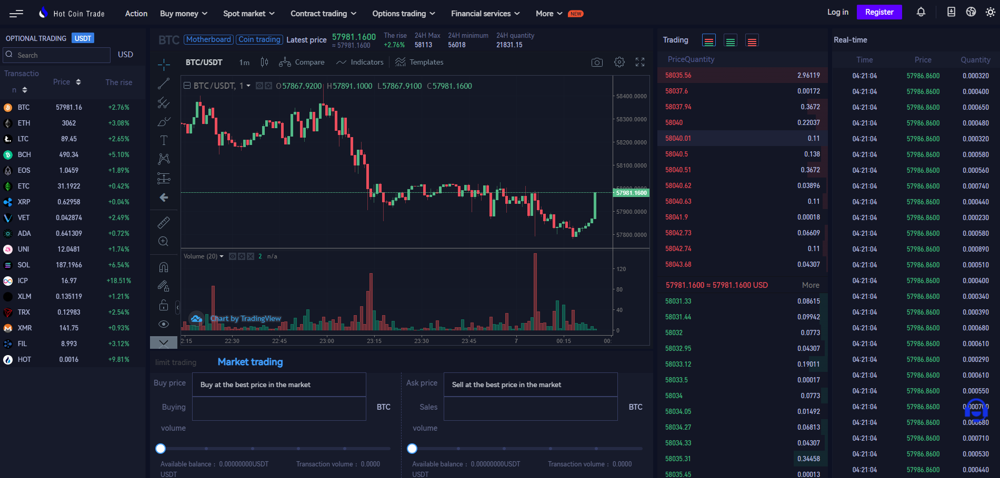
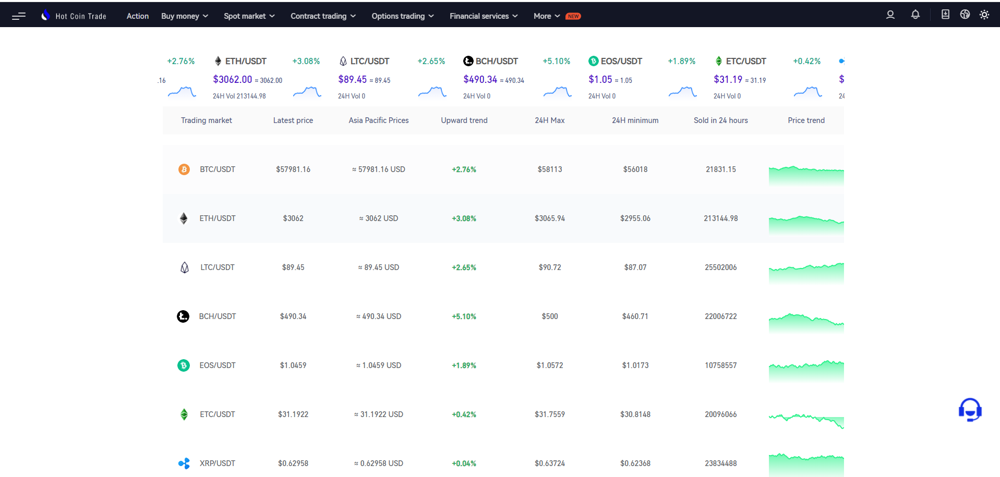
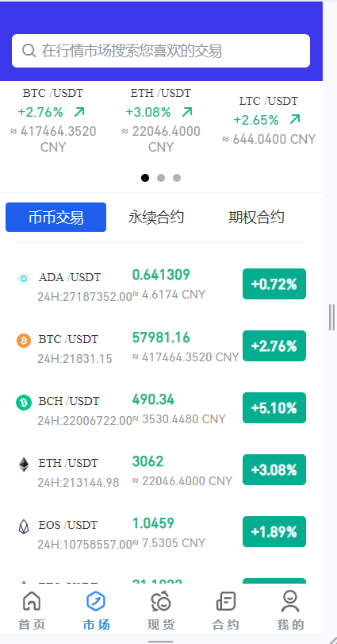
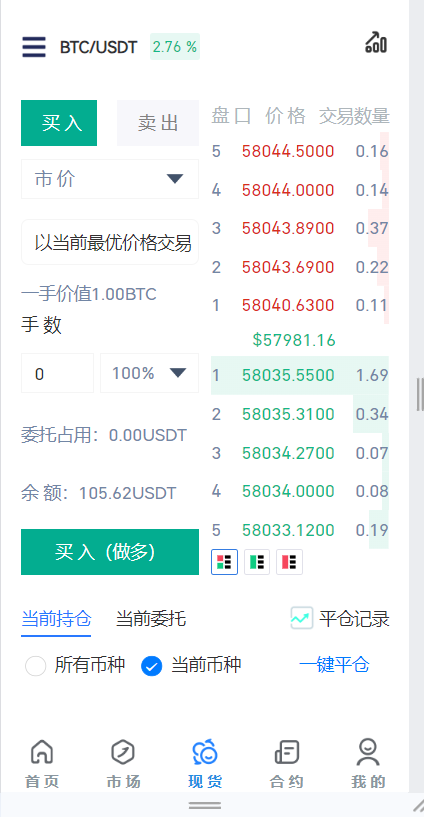
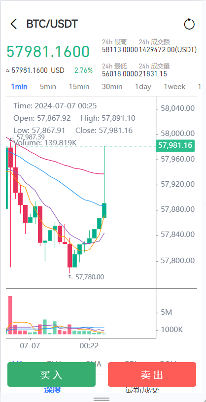
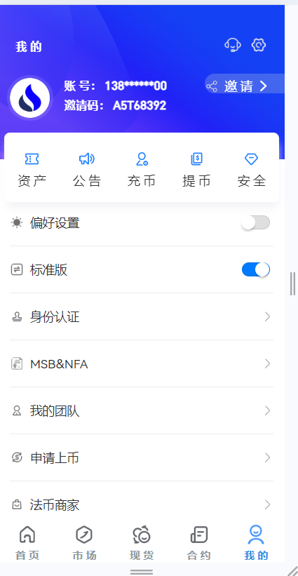
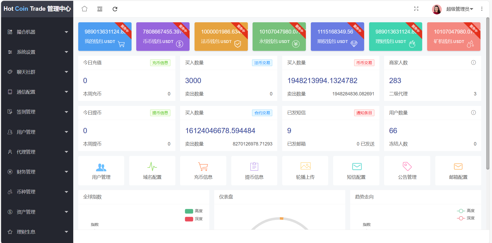

#### 开发环境

- Centos 7.6+
- MySQL 5.7.16+
- Redis 6.2.7
- Mongodb 4.0+
- nginx-1.16.0+
- JRE 8u241
- JDK 1.8
- Vue

#### 项目介绍

1. coin_java
   - 后端项目：实现一些基础功能和管理后台的功能，如：账号注册登录、充提币、轮播、官网和app信息设置等
2. coin_agent_java
   - 后端项目：代理后台
3. coin_market
   - 后端项目：行情服务，对接币安行情服务，包含k线，订单簿，深度等信息
4. coin_pc
   - 前端项目：官网
5. coin_uniapp
   - 前端项目：app端


#### 项目启动

1. 建议16G内存以上的电脑启动
2. 导入coin_trade.sql
3. 修改coin_java和coin_agent_java的application-dev.yaml配置文件


#### 历史K线（全部历史数据，没有最近的数据）

下载币安历史数据，详情查看：https://github.com/binance/binance-public-data

1. 下载PyCharm开发工具，python版本3.10

2. 打开coin_python_script项目

3. 下载k线数据，启动 download-kline.py 脚本，并添加以下运行参数，具体参数查看 coin_python_script 内的 README.md

   ```
   -skip-monthly -t spot -s BTCUSDT ETHUSDT TRXUSDT LTCUSDT BCHUSDT EOSUSDT ETCUSDT XRPUSDT VETUSDT ADAUSDT UNIUSDT SOLUSDT ICPUSDT XLMUSDT XMRUSDT FILUSDT HOTUSDT -i 1m 5m 15m 30m 1h 1d 1w 1M
   ```

4. 导数据到mongodb，启动 import_kline.py 脚本


#### 最近的K线数据（同步最近的1000条数据）

使用http请求币安数据，详情查看：https://github.com/binance/binance-connector-python/tree/master

1. 下载PyCharm开发工具，python版本3.10

2. 打开coin_python_script项目

3. 下载k线数据，配置需要获取的交易对，启动 import_recently_kline.py脚本

   1. 需要开启代理

   

   

#### 钱包

使用优盾钱包

```
https://www.uduncloud.com
```


#### 访问路径

- 管理后台

  ```
  http://localhost:8185/
  账号：admin
  密码：123456
  安全码：123456
  ```

- 代理后台

  ```
  http://localhost:8186/
  账号：13800000000
  密码：123456
  安全码：123456
  ```

- pc端

  ```
   http://localhost:8081
   账号：13000000001
   密码：123456
  ```


- app端

  ```
   http://localhost:8080
   账号：13000000001
   密码：123456
  ```

  

#### 系统截图
















